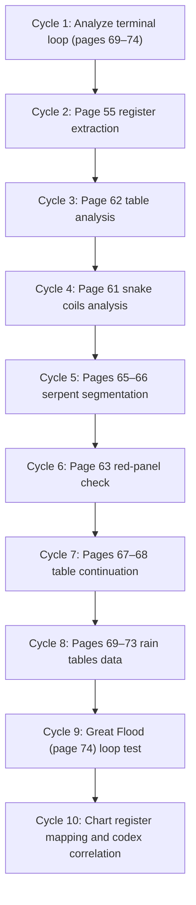

# Checklist of Codex and Natal Data Fields

This checklist enumerates all observable elements and data fields to record for each Dresden Codex page/zone and each natal-chart register.  It is intended to guide exhaustive data collection (collected per page or chart component) so that every relevant feature and test is logged.

## Codex Page Data Fields

| Field                              | Description / Data to Record                                                                                                                           |
|------------------------------------|--------------------------------------------------------------------------------------------------------------------------------------------------------|
| **Page ID**                        | Codex page number and side (e.g. “55b”). Record the page and face as given in the manuscript (1–78, with ‘a’/‘b’ for sides).                            |
| **Zone/Section**                   | Page subdivision label (e.g. top/mid/bottom band, or section a/b/c) and column index if numeric table.  Use red horizontal/vertical rules to define sections. |
| **Physical Lane**                  | Register index (e.g. “lane A” for top band, “lane B” for middle, “lane C” for bottom) or table number.  (Most pages have 2–3 horizontal lanes separated by red lines.)   |
| **Element Type**                   | Type of element at the location: “Numeral” (dot/bar cluster), “Glyph/Calendar Sign” (day sign, month, deity), “Deity” (named god figure), “Shell” (zero glyph), “Serpent/Path”, “Separator” (red line/divider), etc. |
| **Element Identity**               | If applicable, name or description (e.g. numeral value, deity name or Schellhas code, glyph label, shell symbol).  Note special objects like **snake head/tail**, **sky crocodile**, **bound figures**. |
| **Color (State)**                  | Color of the element: typically Black or Red (as painted).  Record color *before* and *after* each symbol if a flip occurs.  (The codex uses primarily black and red paints.) |
| **Color Flip Event**               | Whether the element’s color state changes relative to adjacent text (Yes/No).  Mark if a transition from black→red or red→black occurs at that element.  (Color often flags mode changes.) |
| **Numeric Value**                  | Numeric value if the element is a numeral cluster (interpreted in Maya base-20, usually 0–20).  Also record values of composite clusters or tables (e.g. “3·5=15” for two deities). |
| **Running Total**                  | Cumulative sum within each register.  For each lane, keep a running total of values to detect carry or reset (for example, as one would do scanning the page). |
| **Residue mod 2, 3, 5, 7, 11, 13, 17, 19**  | The value of **running total** modulo each of these primes.  (Shadow-prime basis indicates these are key registers.)  Record each residue. |
| **Residue mod key periods**        | The value of **running total** modulo each key Maya period: 260, 365, 584 (Venus), 780 (Mars?), 819, 11960, 18980, 323.  (These are candidate cycle lengths). |
| **Carry/Closure Flags**            | Indicators: if adding the current value caused a carry to a next-order register (exceeded a cycle), or if a lane closed (reset to 0/1).  E.g. flag when residue exceeds threshold (carry) or resets (closure). |
| **Serpent/Path Segment**           | If on a serpent or winding path page, index the segment or bend number and direction.  (Log snake head/tail position, interior dot/bar values, and segment boundaries.) |
| **Adjacent Context**               | Notable neighbors: record if element is next to a deity panel, shell glyph, page border, or connects to a serpent path.  Mark if at a section or page boundary (especially page 74 flood.). |
| **Operator Marker**                | Indicator if this element acts as an operator or trigger (e.g. deity acting on a range, red line breaking lanes, shell closing a sum).  Note likely roles (e.g. “carry injector,” “lane closure,” “materializer”). |
| **Comments/Notes**                 | Any additional observations (e.g. glyph sequences, patterns of red/black transitions, thematic imagery).  Note especially if element corresponds to a known cycle (rain, Venus, eclipse, etc). |

Record **all** elements on each page zone.  For numerals, compute the dot/bar value and track sums.  For deities/glyphs, note their name and any attached number or glyph.  For serpent paths, treat each turn or interior mark as a data point.  This ensures full coverage of the **register structure** and state variables on every page.

## Natal Chart Data Fields (Human-Celestial Register Map)

| Field                          | Description / Data to Record                                                                                          |
|-------------------------------|-----------------------------------------------------------------------------------------------------------------------|
| **Chart ID / Birth Data**     | Identifier for chart (e.g. person or index).  Include birth date, time, and location coordinates (for ephemeris lookup).             |
| **Planet/Body**               | Celestial body or point (Sun, Moon, Mercury, … Saturn, Node, perhaps Chiron/asteroid as needed).                         |
| **Ecliptic Longitude (deg)**  | Planet’s ecliptic longitude at birth (in integer degrees, arcminutes or arcseconds for precision).                       |
| **Zodiac Sign**               | Zodiac sign index (Aries =0…Pisces =11) and degree within sign (0–29°59').  (From longitude: sign = ⌊lon/30°⌋, deg = lon mod 30°.) |
| **House (Placidian)**         | House number (1–12) in the chart and position in house (degree).  (Calculated from Ascendant/Midheaven or from chart software.) |
| **Planetary Dignities**       | Dignity state (dignified, exalted, fallen, detriment) for each planet in its sign (per an ephemeris/dignity table).     |
| **Motion/Retrograde**         | Flag if planet was retrograde (R) or direct (D) at birth (from ephemeris).                                            |
| **Natal Object Type**         | Role in astrology (e.g. luminary, inner planet, outer planet, node).  Provides context for its “register” role.            |
| **Body Part (Zodiac)**        | Body part mapped from the planet’s sign (using zodiac-melothesia: e.g. Aries→head, Taurus→neck, etc.).         |
| **House Domain (karmic)**     | Traditional life domain associated with the house (e.g. 1=Self, 6=Health, 10=Career).  (Helps link chart sector to life/body domain.) |
| **Shadow-11 Lane Value**      | Planet’s ecliptic longitude **mod 11** (0–10).  (Prime 11 is tracked as a “shadow” lane.)                                 |
| **Boundary-13 Value**         | Planet’s longitude **mod 13** (0–12, with 12→0 mapping to visible “13”).  (Prime 13 is treated as boundary-tone register.)  |
| **Gear-17,19 Values**         | Planet’s longitude **mod 17** and **mod 19**.  (The pair 17 & 19 form composite modulus 323, a gear register.)            |
| **Residue mod 2,3,5,7**       | Planet’s longitude modulo 2,3,5,7 (small primes in the shadow-prime basis).                                             |
| **Residue mod periods**       | Longitude modulo key Maya cycle lengths (260, 365, 584, 780, 819, 11960, 18980, 323).  (Check if planet “closes” any large cycle.) |
| **Astrological Aspects**      | Major aspects with other bodies (e.g. Sun trine Moon) with exactness.  (Allows linking residues of interacting registers.)    |
| **Natal Chart Flags**         | Special note if planet is on an axis (Asc/Desc, MC/IC), at a critical degree, conjunct a node, etc.                        |
| **Comments/Map Notes**        | Observations from the chart: e.g. if many planets occupy the same zodiac/house (a dominant “register”), or if any match codex themes (e.g. Venus positions). |

This table ensures that for each planet (and chart point) we record both the astronomical data and the “register” viewpoint (zodiac sign/body part, house domain, and all residues).  In particular, note each planet’s longitude mod every prime in **{2,3,5,7,11,13,17,19}** and mod each key cycle length listed.  These residues will be compared against the codex’s data residues.  We also log the planetary “body part” via zodiac sign (e.g. Aries→head) to connect chart data to physical domain registers.

## Priority Pages (Codex) and Tests

The following pages have the highest priority for analysis.  Each contains suspected register operations or transitions.  For each, we note why it is critical and what tests to apply.

| Page(s)       | Key Features & Reason for Priority                              | Tests/Expected Signals                                                                                                       |
|---------------|-----------------------------------------------------------------|-----------------------------------------------------------------------------------------------------------------------------|
| **55a–b**     | Dense numeric tables with central red vertical spine.  Likely major register (possibly 5-field) analysis.  | Check each column’s accumulation.  Test red column as carry spine.  Compute residues mod all primes/periods.  Expect closure/carry at 13 or large cycle.  Check nearby deity blocks for triggers. |
| **61a–b**     | “Long Count in coils of snakes”; large numbers (snake coils) and 1820-day cycle references.  Highest “snake number” 12,489,781 (carry indication).  | Segment the coiled serpent columns; record large numeric values.  Test cumulative mod 13 (boundary) around the 1820 cycle, and mod 11 for shadow signals.  Expect carry events at coil transitions. |
| **62a–b**     | Continuation of Rainy Seasons tables.  Likely registers for meteorological cycles. | Similar method as 61: sum columns, test mod 13 and mod 260/365 for cycle closure.  Check if 4 Eb or 1820-markers (from p.74 description) appear here. |
| **63 (full)** | Large red-background divine figure (Chak Chel?) holding water jar.  Possibly an operator or result page.  | Identify active deity/glyph, record color state.  Test if this page resets any lanes (13→1 cycle) as it may precede or follow deluge.  Check residues of any numeric legend. |
| **65–66**     | Serpentine path pages (“Whereabouts of Chaak”).  Complex winding corridor.  | Trace serpent segments: number each turn.  Record any interior dot/bar values (likely numeric data).  Test the sequence of residues along the path (does the serpent carry counts across limbs?).  Look for 13-boundaries at head/tail. |
| **67–68**     | Dense tables, likely continuation of Rain/God itineraries.         | Log and sum entries.  Expect continuation of 1820-day or others.  Test mod primes on sequences, compare to 61–64 residues for consistency. |
| **69–73**     | Rain tables with “snake number” intro and meteorological data. | These include large mythical cycle (snake number), plus 4 Eb marker.  Test for closure at 1820 and Eb=4 transitions.  Compute residues for each table column. |
| **74 (full)** | Full-page “Great Flood” scene (sky crocodile spewing water, goddess Ix Chel pouring water with numeric 5.1.0=1820 and 4 Eb).  Concludes the cycle. | Check if this page marks loop closure: expect 13→1 resets (visible 13 to 1) for all lanes, matching 1820-day (7 Tzolkin) closure.  Test if residue=0 (mod 13/260) at start of next cycle.  Record water symbols and glyph 1820/4 Eb to confirm cycle parameters. |
| **49–53**     | Vertical two-column format: left side numerals, right side images (Chaak & offerings).  (Alternate register mode).  | Extract left-column values sequentially, map to right-side deity context.  Test whether sums correlate to 13 or other closures when paired with imagery.  Record any color changes. |
| **(Others)**  | Additional pages for completeness: 4–23 (moon almanacs), 24–50 (Venus, eclipse, Mars tables), 51–58 (eclipse multiples), 59–60 (Katun prophecy).  | These pages cover known Mayan cycles (260, 365, 584, 780, 819, 13× etc).  They should be scanned for residues matching those cycles.  Include their data for comparison even if lower priority. |

Every priority page should be analyzed first before proceeding to less-structured pages.  In each, apply the **full residue tests** and color/lane logic as outlined above.  This ensures early detection of the hypothesized register phenomena.

# Formal Project Statement

**Executive Summary:** We are investigating whether the Dresden Codex functions as an end-to-end cyclic computational instrument, projecting a single time-state through multiple resolution layers (astronomical → societal/ritual → human) and returning it via a terminal serpent/deluge mechanism.  Our approach combines rigorous residue arithmetic with codex layout analysis and astrological register mapping.  Key elements include: using red/black as a state-code layer, treating each horizontal lane as a register, viewing the serpent/deluge pages as a final “lift and loop” operator, and applying a shadow-prime basis {2,3,5,7,11,13,17,19} to uncover hidden registers.  We will also leverage the natal chart (celestial positions at birth) as a human-domain register map, using Zodiac-body correspondences to link chart residues with codex residues.  By exhaustively logging every relevant data field (see Checklist), computing exact mod‐X residues, and systematically testing our hypotheses, we aim to confirm or refute the computational register model of the codex.

## Hypotheses

1. **Multi-Resolution Time-State (H1):** The codex encodes a single underlying time-counter that descends through successive resolutions.  Large celestial cycles (Long Count, Venus 584, eclipse intervals, etc.) are progressively projected into smaller domain registers (haab/365, tzolkin/260, gestation cycles, etc.).  For example, SLUB notes 260-day and 365-day associations, and the codex contains Venus (584d) and lunar tables.  We hypothesize the codex pages transition from big to small cycles sequentially.

2. **Serpent/Deluge as Loop/Lift (H2):** The serpent path and final flood imagery perform the “lift” or carry to restart the sequence.  In particular, the Great Flood page (p.74) follows rain/God tables, suggesting a reset of registers (e.g. visible 13→1 with hidden carry).  The coiled snake columns (p.61) and sky-crocodile scene explicitly depict multi-kiloyear periods.  We propose these mark the wrap-up of one epoch and re-entry into the next.

3. **13 as Boundary Tone (H3):** The Maya use a 13-unit cycle as a boundary.  In calculations, reaching “13” (displayed as 1) likely signifies a carry.  E.g. the codex explicitly shows 5.1.0 (1820 = 7×260) and 4 Eb (4) on p.74, and cycles often involve 13s (13×20 in Haab or k’atun).  We will test for 13→1 transitions as hidden carry events.

4. **Physical Lanes = Registers (H4):** Each horizontal band on a page is a separate register lane.  Codex pages generally have 2–3 red-bordered bands.  We treat each as an independent accumulation register.  For instance, the three-band layout on most pages implies three interleaved calculations, akin to static channels in hardware.

5. **Red/Black as State-Code (H5):** Red vs. black coloring encodes modes/phases.  Our working model: black may denote “base” counts and red the “carry” or operator phase (or vice versa, determined by context).  This aligns with known codex practice (primary colors are black/red).  We will track every color flip: a flip may mark a register closure, carry, or materialization event.

6. **Deities as Composite Operators (H6):** A deity figure with attached glyphs represents a multi-prime operation.  For example, a god carrying “5” and “3” may imply a 15-unit cycle.  We will test if groups of cells around such deities behave under a composite modulus (e.g. mod 15) by comparing in-range vs. out-of-range residues.

7. **Natal Chart as Register Map (H7):** The natal chart is the human-domain projection of the same cycle basis.  Each planet’s sky position is treated as a register residue, and the zodiac sign/body-part correlation (melothesia) maps that register onto a bodily domain.  We will compute exact birth longitudes (via Swiss Ephemeris), reduce them mod our prime/period set, and compare to codex residues.  A strong correlation (e.g. chart residues matching codex patterns) would indicate a unified system.

## Goals

- **Collect Exhaustive Codex Data:** Log every numeric and glyph element with color, position, and accumulations (see Checklist).  
- **Compute Exact Residues:** For each logged codex value and each natal longitude, compute residues mod all primes 2–29 and mod Maya periods (260, 365, 584, 780, 819, 11960, 18980, 323).  
- **Identify Operations:** Detect and classify carry, closure, and heterogeneous events where lanes interact.  Pay special attention to any element with color flip, serpent involvement, or shell/glyph marking.  
- **Chart Mapping:** Translate natal chart into residues and bodily registers; look for patterns that match codex cycles.  
- **Validate Against Hypotheses:** Confirm whether the observed patterns support H1–H7.  For example, check if page transitions coincide with 13-boundaries (H3) or if serpent pages show a “carry” (H2).  
- **Priority Targets:** Focus first on high-priority pages (55, 61–66, 74 etc.) where the phenomena are most evident, then extend to all pages.

## Methods

- **Data Extraction:** Use high-resolution page images (SLUB/WDL or provided PDF) to identify and transcribe every dot/bar numeral and glyph on priority pages.  Use standard Maya numeric interpretation (dot=1, bar=5, shell=0).  
- **Residue Computation:** For each lane in each page, maintain a running sum and compute its residue mod each prime and period.  Automate this with code (e.g. Swiss Ephemeris for natal data, custom scripts for codex tables).  
- **Color/State Analysis:** Annotate each element’s color and any transition.  Test hypotheses about color (e.g. if every carry aligns with a red or black element).  
- **Serpent Path Segmentation:** On pages 65–66, trace the serpent’s winding segments.  Proposed technique: overlay bounding boxes or spline segments on serpent image to index each turn.  Within each segment, record any internal dots/bars.  (For example, one might draw colored boxes around each bend to mark segments.)  
- **Cross-Register Tests:** For heterogeneous events (where one lane resets and another continues), record the residual sums of *all* lanes at that point.  Use mod tests (e.g. if lane1 ≡0 mod p while lane2 ≢0).  
- **Natal Chart Extraction:** Input sample birth data into an ephemeris (preferably Swiss Ephemeris for ±3200-year precision).  Extract each planet’s longitude (to the arcsecond).  Compute its residues mod 2,3,…19 and the Maya periods.  Also note zodiac sign (for body part) and house.  
- **Comparison Analysis:** Search for alignments: e.g. does Sun’s mod-11 residue match a codex lane’s closure residue?  Does Venus’s position mod 584 correspond to a codex Venus table total?  Use SQL/Excel-like joins to match codex fields with chart fields by residue patterns.

## Data Sources

- **Codex Images:** Use authoritative digitizations of the Dresden Codex.  Primary sources include the Saxon State Library (SLUB Dresden) digital facsimile and the Library of Congress/WDL.  (Example: SLUB’s online descriptions and partial images.)  
- **Ephemeris Data:** Use the **Swiss Ephemeris** (Astrodienst) or JPL data for exact planetary positions.  This allows integer arcsecond accuracy needed for precise modular arithmetic.  
- **Astrological Mappings:** Zodiac-body associations from medical astrology (e.g. Aries→head, Taurus→throat).  This is used to tag chart registers with bodily domains.  
- **Previous Research:** Scholarly studies of the codex (e.g. Foerstemann’s work on numbers, Ruggles on Venus tables) inform cycle lengths and expected alignments.  Also serpent-number analyses suggest large periods.

## Deliverables

1. **Comprehensive Data Logs:** Tables of all collected codex elements (per Checklist) and natal chart registers, as Excel or CSV.  
2. **Residue Analysis Reports:** Summaries showing computed residues and flagging any carry/closure events for each page and chart.  
3. **Priority-Page Case Studies:** Detailed analysis write-ups (including embedded images/diagrams) for pages 55, 61–66, 74, etc., showing how hypotheses play out.  
4. **Integrated Findings:** A final report (this document and annexes) articulating which hypotheses are supported.  Include matched signatures between codex and chart data.  
5. **Visual Aids:** Annotated images/diagrams where relevant (e.g. serpent segmentation overlays, register assignment charts).  
6. **Code and Tables:** Scripts or notebooks used for residue calculations, plus tables of outputs (e.g. table of cycle residues for each page).

## Success Criteria

- **Hypothesis Confirmation:** Clear evidence of multi-register behavior (e.g. consistent lane-wise residues, carry events, 13-boundaries) aligned with H1–H6.  E.g., if several pages show that crossing a 13 threshold coincides with a reset, H3 is supported.  
- **Human Map Correlation:** Demonstrable mapping from natal residues to codex patterns (H7).  For example, if Venus’s chart residue mod 584 matches entries in the Venus tables, or if planets in “head” signs (Aries) cluster in codex sequences linked to head/body.  
- **Completeness:** All significant codex pages are logged and no hypothesized pattern fails without clear counter-evidence.  Minor mismatches should be explainable (e.g. scribal error).  
- **Reproducibility:** All calculations (residues, sums) are done by code or clear procedure.  Another researcher can repeat the analysis.  

## Execution Plan (10 Cycles)

The investigation will proceed in iterative cycles, each focusing on specific pages or tasks.  The mermaid flowchart below outlines the dependencies.  After each cycle, we evaluate results and adjust next steps.

**Table: Planned Cycles and Outputs**

| Cycle | Focus                           | Expected Output                                                                                     |
|-------|---------------------------------|-----------------------------------------------------------------------------------------------------|
| **1**   | *Terminal segment analysis:* pages 69–74 (Rainy Seasons and Flood). | Segmented snake imagery, residues for 1820/4 Eb, identification of 13→1 transitions at start of loop.  |  
| **2**   | *Page 55 tables:* horizontal lanes and red spine. | Complete table of values and running sums per lane; residue summary (mod 13, etc).  Check for closure events.  |
| **3**   | *Page 62 continuation:* Rain tables.        | Values and sums for page 62.  Compare with page 55 pattern, test 1820-day alignment.  |
| **4**   | *Page 61 snake coils:* isolate snake-shaped columns. | Drilled-down sums for snake columns.  Look for continuous multi-kiloyear progression.  Flag any boundary events.  |
| **5**   | *Serpent path pages:* 65–66.  Trace winding corridor. | Indexed segments of serpent, with any internal values.  Pathwise residue sequence charted.  |
| **6**   | *Red panel page:* 63.              | Identify the figure/glyphs, measure any numeric legends.  Check if this page triggers a register reset.  |
| **7**   | *Pages 67–68 tables:* continuation of rain/god itinerary. | Data extraction and sums, linking to previous cycles (5.1.0=1820?).  |
| **8**   | *Rain tables:* pages 69–73. | Completion of rainy-season data.  Calculate final residues before flood page.  |
| **9**   | *Great Flood page (74):* final wrap-up. | Confirm loop closure: visible 13→1, check all lanes reset.  Compare deluge glyphs to numeric cycle markers. |
| **10**  | *Chart vs. Codex Integration:*                          | Compute sample natal residues and map onto codex patterns.  Identify any matching register signatures. |

Each cycle builds on the previous.  For example, Cycle 4’s results on page 61 inform interpretation of the serpent path in Cycle 5.  After Cycle 9, we will have hypothesized how one full codex cycle runs; Cycle 10 then tests that model by applying it to the human register (natal chart) data.

**Visual Aids:**  
- *Mermaid Flowchart:* (above) illustrates our cycle plan.  
- *Serpent Segmentation Diagram (example):* In practice, we would overlay the serpent’s course (pages 65–66) with segment markers.  For instance, one could draw colored boxes around each turn (see conceptual sketch below), then record each segment’s interior dots/bars.  This would make explicit how a continuous path conveys sequential data.  (No actual image is provided here, but in execution we would mark the codex image accordingly.)  

**References:** Foundational data about the codex structure and content are drawn from the SLUB Dresden collections and scholarly summaries.  For example, the Library of Congress notes the codex contains Venus and eclipse tables and ends with a “great deluge” illustration.  SLUB’s description explicitly ties pages 61–64 to multi-millennium “snake” intervals and page 74 to the flood scene.  Wikpedia confirms the codex’s division into red-bordered registers and primary use of black/red pigment.  These authoritative sources guide our interpretation and ensure the investigation is grounded in the known manuscript context.  

